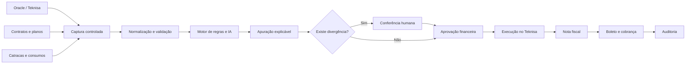

# POC de Automação Inteligente de Faturamento

## Grupo Raízes + Lend

**Status do material:** protótipo navegável com dados demonstrativos  
**Objetivo:** validar a jornada, as regras de negócio e o modelo de automação antes de integrar a solução ao ambiente crítico do Grupo Raízes.

---

## 1. Resumo executivo

O Grupo Raízes solicitou uma solução para automatizar o processo de faturamento hoje executado com extrações do ERP, planilhas individuais por cliente e um RPA legado.

A POC foi desenhada para demonstrar três capacidades principais:

1. **Capturar e organizar os dados** provenientes do Oracle/Teknisa, contratos, planos escolares e catracas.
2. **Aplicar as regras de faturamento** de Cucinari e Quitanda Escolas, explicando cálculos e identificando divergências.
3. **Controlar e executar o faturamento**, com aprovação humana antes da emissão de nota fiscal, boleto e cobrança.

A aplicação organiza todo o trabalho em uma única jornada, mas separa claramente cálculo, aprovação e execução. Assim, a POC pode ser validada sem colocar o faturamento real em risco.

> **Mensagem principal para o cliente:** a POC demonstra como retirar o cálculo das planilhas, centralizar as regras contratuais, controlar exceções e preparar a substituição do RPA legado.

---

## 2. O que entendemos da necessidade

### Cucinari

O faturamento da Cucinari atende aproximadamente 160 clientes/unidades. Cada contrato pode possuir condições próprias, como:

- quantidade mínima de refeições;
- faturamento mínimo garantido;
- valores unitários específicos;
- complementos de faturamento;
- descontos e condições por período;
- cláusulas ainda não existentes em outros contratos.

Hoje, os serviços realizados são registrados no ERP e posteriormente combinados com as regras de cada contrato em planilhas. A solução proposta substitui essa etapa manual por um motor de faturamento controlado e auditável.

### Quitanda Escolas

A Quitanda Escolas possui duas modalidades:

- **Pré-pago:** faturamento baseado nos planos ou pacotes contratados pelos responsáveis financeiros.
- **Pós-pago:** faturamento baseado no consumo efetivamente registrado pelas catracas dos refeitórios.

As duas modalidades utilizam o mesmo fluxo operacional, mudando apenas a origem dos dados e as regras aplicadas.

### Substituição do RPA

Depois da apuração e aprovação, a solução deverá substituir o RPA legado na execução das seguintes atividades:

- lançamento do faturamento no Teknisa;
- geração e transmissão das notas fiscais;
- geração dos boletos;
- envio das cobranças aos clientes;
- registro de todas as ações para auditoria.

---

## 3. Fluxo funcional proposto



O fluxo possui três zonas de responsabilidade:

| Zona | Função | Resultado |
|---|---|---|
| Inteligência | Capturar, organizar, interpretar regras e calcular | Apuração explicada |
| Controle humano | Conferir exceções e aprovar | Faturamento autorizado |
| Automação | Executar no ERP, emitir e cobrar | Ciclo concluído e auditado |

---

## 4. Organização da aplicação

A aplicação possui filtros globais para separar as operações sem criar sistemas diferentes:

- **Todas**;
- **Cucinari**;
- **Quitanda Escolas**.

Quando Quitanda Escolas é selecionada, a aplicação permite separar:

- Pré-pago;
- Pós-pago.

Quando Cucinari é selecionada, a modalidade apresentada é contratual.

Os filtros também consideram a competência de faturamento. Na POC atual, a competência demonstrativa é julho de 2026.

---

## 5. Validação tela a tela

### 5.1 Visão geral

**Finalidade:** apresentar rapidamente a situação da competência atual.

**O que demonstra:**

- valor total apurado;
- clientes processados;
- itens aguardando aprovação;
- divergências abertas;
- pipeline da captura até a cobrança;
- apuração resumida por cliente;
- pendências identificadas pelo motor;
- aviso de que o controle humano está ativo.

**Aderência ao pedido:** alta. Consolida o acompanhamento do processo sem misturar configuração, cálculo e execução.

**Status atual:** navegável, com filtros funcionando sobre os dados demonstrativos.

### 5.2 Dashboard

**Finalidade:** fornecer uma leitura gerencial e financeira da operação.

**O que demonstra:**

- gráfico de barras com faturamento por operação ou modalidade;
- gráfico de linha com evolução do faturamento nos últimos seis meses;
- gráfico de rosca com aprovados, itens em revisão e divergências;
- atualização dos gráficos conforme o filtro Cucinari ou Quitanda Escolas.

**Aderência ao pedido:** complementar. Não é o núcleo transacional, mas ajuda o financeiro e a liderança a entender volume, tendência e risco.

**Status atual:** funcional com dados demonstrativos.

### 5.3 Execuções

**Finalidade:** representar os ciclos de faturamento por competência.

**O que demonstra:**

- lista de execuções;
- operação e modalidade;
- competência;
- valor e situação;
- ação para iniciar uma nova execução;
- continuidade para a captação dos dados.

**Aderência ao pedido:** alta. O processamento precisa ser controlado por ciclo, sem misturar competências.

**Status atual:** parcialmente funcional. A lista e a navegação existem, mas o formulário completo de criação da execução ainda precisa ser implementado.

### 5.4 Clientes e contratos

**Finalidade:** centralizar a base contratual hoje distribuída em planilhas.

**O que demonstra:**

- cliente e unidade;
- operação;
- modalidade;
- valor ou volume de referência;
- situação do cadastro;
- continuidade para a gestão das regras.

**Aderência ao pedido:** alta. Essa base é necessária para suportar contratos diferentes e novos clientes.

**Status atual:** demonstrativo. Ainda não possui inclusão, edição, anexos, vigência ou histórico persistente.

### 5.5 Regras de negócio

**Finalidade:** permitir que novas condições contratuais sejam cadastradas sem alteração de código.

**O que demonstra:**

- regras vinculadas à operação ou ao cliente;
- explicação da condição;
- confiança da interpretação;
- versão e situação da regra;
- exemplo de complemento de faturamento mínimo;
- exemplo de plano escolar pré-pago;
- ação para cadastrar uma condição inédita.

**Aderência ao pedido:** crítica. É o principal diferencial em relação ao processo atual baseado em Excel.

**Status atual:** demonstrativo. O editor visual, a interpretação de contratos e o versionamento real ainda precisam ser desenvolvidos.

### 5.6 Captação de dados

**Finalidade:** separar a extração dos dados da apuração do faturamento.

**O que demonstra:**

- Oracle/Teknisa;
- contratos;
- planos da Quitanda Escolas;
- catracas;
- volume capturado;
- situação da fonte;
- horário da última sincronização;
- progresso da captura.

**Aderência ao pedido:** crítica. Evita executar cálculos diretamente na origem e permite validar os dados antes do faturamento.

**Status atual:** simulado. Não existe conexão real com Oracle, navegador do ERP, catracas ou arquivos.

### 5.7 Faturamento

**Finalidade:** demonstrar o motor de cálculo e a explicação das regras aplicadas.

**O que demonstra:**

- cliente identificado;
- consumo realizado;
- mínimo contratual;
- diferença calculada;
- complemento de faturamento;
- justificativa da regra aplicada;
- etapas internas do processamento.

**Exemplo apresentado:**

```text
Consumo realizado:       8.500 refeições
Mínimo contratual:      10.000 refeições
Diferença:               1.500 refeições
Complemento calculado:  R$ 25.005,00
```

**Aderência ao pedido:** crítica. Representa a substituição do cálculo manual feito nas planilhas.

**Status atual:** demonstrativo. O cálculo exibido é estático e ainda não é executado por um motor real de regras.

### 5.8 Divergências

**Finalidade:** criar uma barreira de segurança antes do faturamento real.

**O que demonstra:**

- consumo fora do padrão;
- cláusula contratual ainda não reconhecida;
- severidade;
- explicação da ocorrência;
- ações de reprocessar, editar, validar ou aprovar;
- registro visual da decisão humana.

**Aderência ao pedido:** crítica, considerando o risco operacional destacado pelo cliente durante a reunião.

**Status atual:** interações demonstrativas. Os botões confirmam a ação, mas ainda não alteram uma base persistente nem recalculam os valores.

### 5.9 Notas fiscais

**Finalidade:** representar a etapa de execução no Teknisa depois da aprovação.

**O que demonstra:**

- número da nota;
- cliente e unidade;
- operação;
- competência;
- valor;
- situação;
- ação de simulação da emissão.

**Aderência ao pedido:** alta. Corresponde à primeira parte da substituição do RPA legado.

**Status atual:** totalmente simulado. Nenhuma nota fiscal real é criada ou transmitida.

### 5.10 Boletos e cobranças

**Finalidade:** acompanhar a conclusão financeira do processo.

**O que demonstra:**

- cliente;
- operação e modalidade;
- competência ou vencimento;
- valor;
- situação;
- simulação do envio da cobrança.

**Aderência ao pedido:** alta. Representa a geração de boleto e o disparo ao cliente mencionados na reunião.

**Status atual:** totalmente simulado. Não existe integração bancária ou envio real de e-mail.

### 5.11 Auditoria

**Finalidade:** manter rastreabilidade do início ao fim.

**O que demonstra:**

- captura dos dados;
- identificação do contrato;
- aplicação da regra;
- apuração;
- ação humana;
- preparação do lançamento no ERP;
- horários e origem da ação.

**Aderência ao pedido:** alta. Permite explicar como cada valor foi calculado e quem aprovou sua execução.

**Status atual:** demonstrativo e não persistente.

### 5.12 Configurações

**Finalidade:** tornar explícitas as proteções do ambiente da POC.

**O que demonstra:**

- modo seguro ativo;
- aprovação humana obrigatória;
- integração Oracle/Teknisa desabilitada;
- separação entre demonstração e produção.

**Aderência ao pedido:** alta para a POC, devido à criticidade do faturamento.

**Status atual:** visual. As configurações ainda não controlam serviços reais.

---

## 6. O fluxo está completo?

### Como demonstração de jornada: sim

A POC cobre visualmente o caminho completo solicitado:

```text
Captura
  → regras e IA
  → apuração
  → divergências
  → aprovação humana
  → execução no Teknisa
  → nota fiscal
  → boleto e cobrança
  → auditoria
```

Ela também diferencia corretamente Cucinari, Quitanda Escolas Pré-pago e Quitanda Escolas Pós-pago.

### Como sistema integrado e pronto para produção: ainda não

A versão atual é um protótipo funcional de interface. Ainda são necessários:

1. conexão de leitura com o Oracle/Teknisa;
2. definição das consultas, tabelas e permissões disponíveis;
3. importação real de planos, catracas, contratos e consumos;
4. banco de dados da solução e histórico por competência;
5. cadastro e versionamento real de contratos e regras;
6. motor determinístico de cálculo;
7. uso de IA para interpretar documentos e sugerir regras;
8. fluxo persistente de revisão e aprovação;
9. integração de escrita no Teknisa ou automação segura pela interface web;
10. emissão e transmissão real de notas fiscais;
11. integração para boletos e envio de e-mails;
12. autenticação, perfis, segregação de funções e trilha imutável;
13. testes automatizados e homologação com o time financeiro;
14. monitoramento, suporte, infraestrutura e controle de consumo de IA.

---

## 7. Lacunas identificadas na interface atual

Antes de uma demonstração de validação final com o cliente, recomendamos evoluir os seguintes pontos:

| Prioridade | Lacuna | Evolução recomendada |
|---|---|---|
| Alta | Nova execução sem formulário completo | Incluir competência, operação, modalidade, cliente/unidade, período e fonte |
| Alta | Regras apenas demonstrativas | Criar formulário para condição, fórmula, vigência, cliente e aprovação |
| Alta | Cálculo estático | Permitir alterar consumo e mínimo para demonstrar recálculo em tempo real |
| Alta | Aprovação não altera o estado | Atualizar status, responsável, horário e liberar a próxima etapa |
| Alta | Execução no ERP sem etapa própria | Exibir fila, progresso, interrupção e resultado por cliente |
| Média | Busca e filtros secundários visuais | Aplicar filtros reais às tabelas |
| Média | Contrato sem detalhe | Exibir cláusulas, vigência, anexos e histórico de versões |
| Média | Cobrança sem detalhe de entrega | Exibir destinatário, vencimento, envio e falha |
| Média | Falta uma página de integrações | Exibir Oracle, Teknisa Web, catracas, e-mail e banco |
| Média | Falta uma página de relatórios | Permitir exportar apuração, divergências e auditoria |

Essas lacunas não impedem a apresentação do conceito, mas devem ser explicadas como próximas evoluções da POC.

---

## 8. Roteiro sugerido para apresentação ao cliente

### Abertura

> “Transformamos o processo relatado na reunião em uma jornada única de faturamento. A proposta elimina a dependência das planilhas, centraliza contratos e regras e mantém uma aprovação humana antes de qualquer execução no ERP.”

### Demonstração

1. Começar na **Visão geral** e apresentar os indicadores da competência.
2. Abrir o **Dashboard** e mostrar os cortes por Cucinari e Quitanda Escolas.
3. Entrar em **Execuções** e explicar que cada competência possui seu próprio ciclo.
4. Mostrar **Clientes e contratos** como substituição da base fragmentada em Excel.
5. Mostrar **Regras de negócio** e destacar a inclusão de condições inéditas sem alteração de código.
6. Abrir **Captação de dados** e explicar a separação segura entre origem e cálculo.
7. Abrir **Faturamento** e apresentar o exemplo de consumo mínimo e complemento.
8. Abrir **Divergências** e reforçar a aprovação humana obrigatória.
9. Mostrar **Notas fiscais** e **Boletos e cobranças** como substituição futura do RPA.
10. Encerrar em **Auditoria**, mostrando a rastreabilidade completa.

### Encerramento

> “Nesta fase, estamos validando a jornada e as regras sem acessar a operação crítica. Após a validação do Grupo Raízes, a próxima etapa é conectar uma amostra controlada de dados reais, implementar os cálculos e homologar os resultados em paralelo ao processo atual.”

---

## 9. Escopo recomendado para a POC técnica

Para reduzir risco e permitir comparação objetiva, recomendamos começar com:

- uma competência já encerrada;
- dois ou três clientes da Cucinari com regras diferentes;
- uma escola com modalidade pré-paga;
- uma escola com modalidade pós-paga;
- extração somente leitura;
- cálculo paralelo, sem lançamento real no ERP;
- comparação entre resultado da solução e planilhas atuais;
- aprovação formal do financeiro;
- execução no Teknisa inicialmente simulada.

### Critérios de sucesso

- dados capturados correspondem às fontes originais;
- cálculos correspondem às planilhas homologadas;
- todas as regras aplicadas possuem explicação;
- divergências são encaminhadas para revisão;
- nenhuma execução ocorre sem aprovação;
- toda ação possui data, usuário e origem;
- novos contratos podem receber regras sem alteração de código;
- tempo operacional é menor que o processo manual atual.

---

## 10. Próximas decisões necessárias

Para avançar da interface para a POC técnica, precisamos validar com o Grupo Raízes:

1. quais clientes e escolas participarão da amostra;
2. qual competência encerrada será utilizada;
3. quais tabelas e visões do Oracle poderão ser consultadas;
4. como serão disponibilizados contratos, planos e dados de catraca;
5. quais planilhas atuais servirão de referência;
6. quais regras devem fazer parte da primeira homologação;
7. quem poderá revisar e aprovar divergências;
8. se a execução no Teknisa continuará simulada durante toda a POC;
9. onde os agentes e o banco da solução serão hospedados;
10. requisitos de segurança, LGPD, retenção e auditoria.

---

## 11. Conclusão

A interface atual representa corretamente o fluxo solicitado na reunião e já pode ser usada para validar a compreensão da jornada com o cliente.

O maior valor demonstrado está na separação entre:

- **dados capturados**;
- **regras contratuais**;
- **cálculo do faturamento**;
- **controle humano**;
- **execução automatizada**.

Essa separação reduz o risco, melhora a rastreabilidade e cria uma base segura para substituir gradualmente as planilhas e o RPA legado.

O próximo passo não deve ser ativar a emissão real. O próximo passo recomendado é homologar uma amostra de cálculos reais em paralelo ao processo atual e somente depois avançar para a automação da execução no Teknisa.
