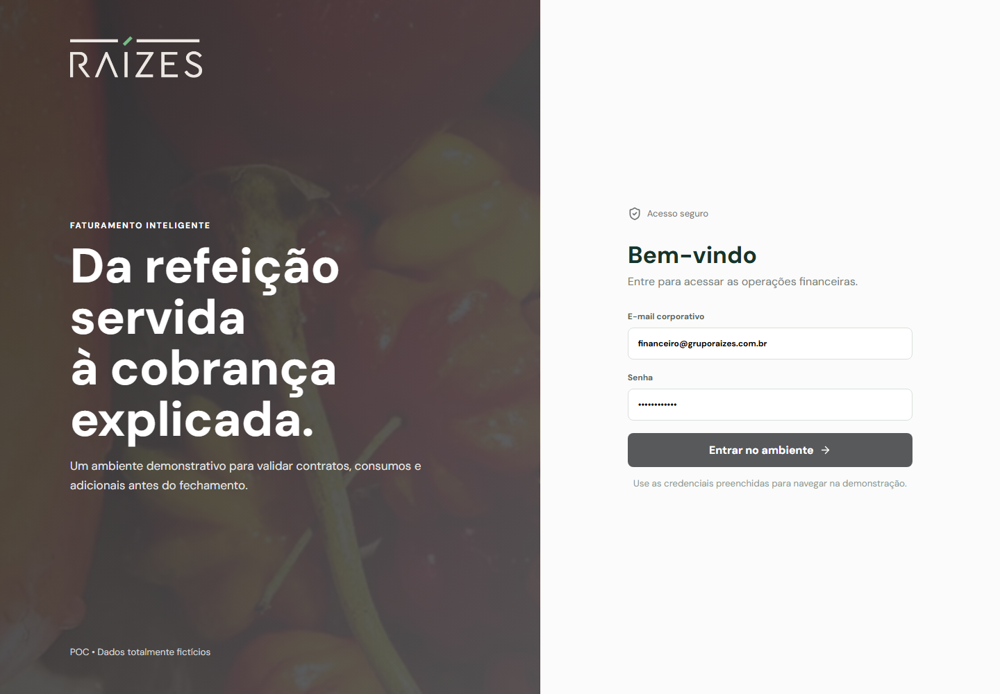
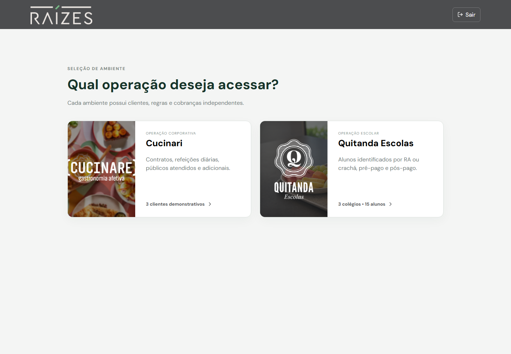
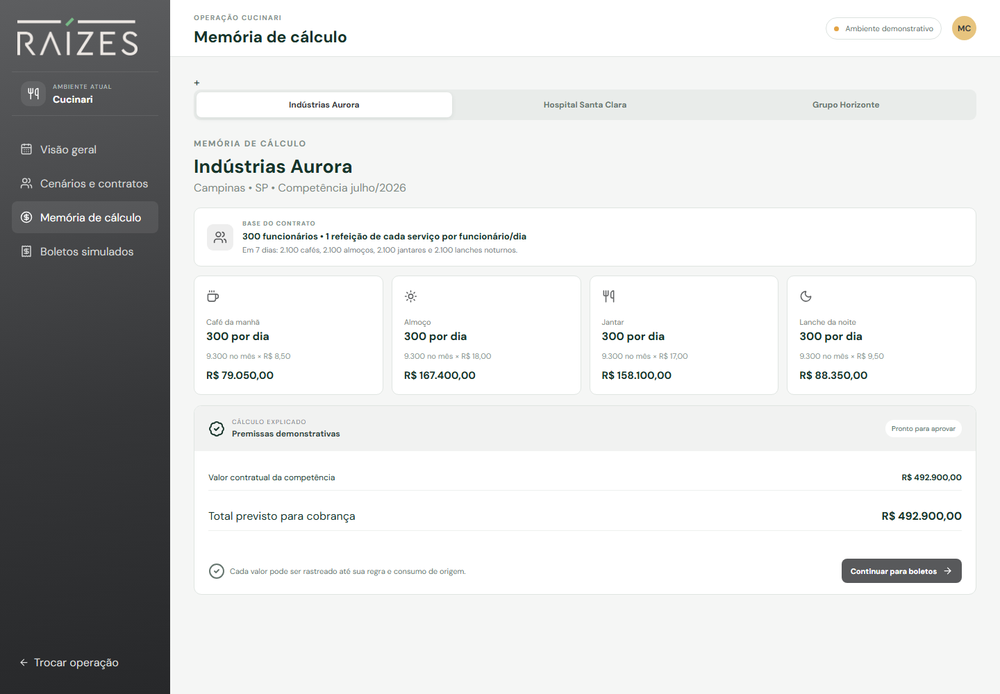
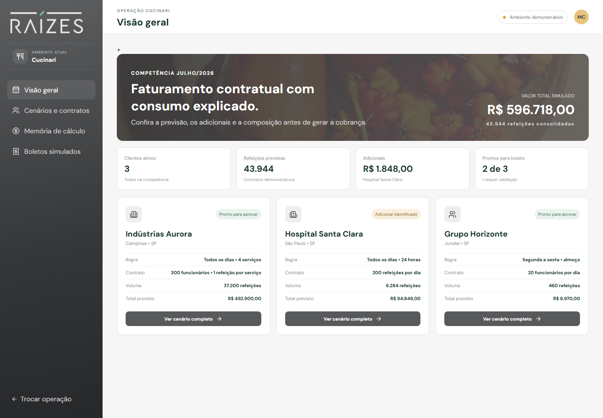
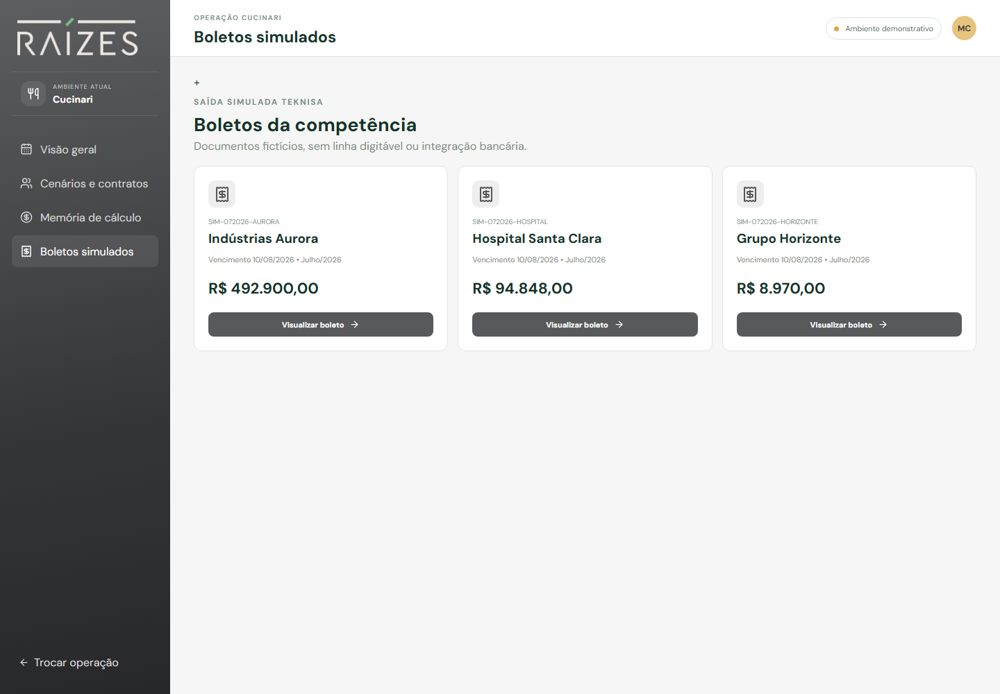
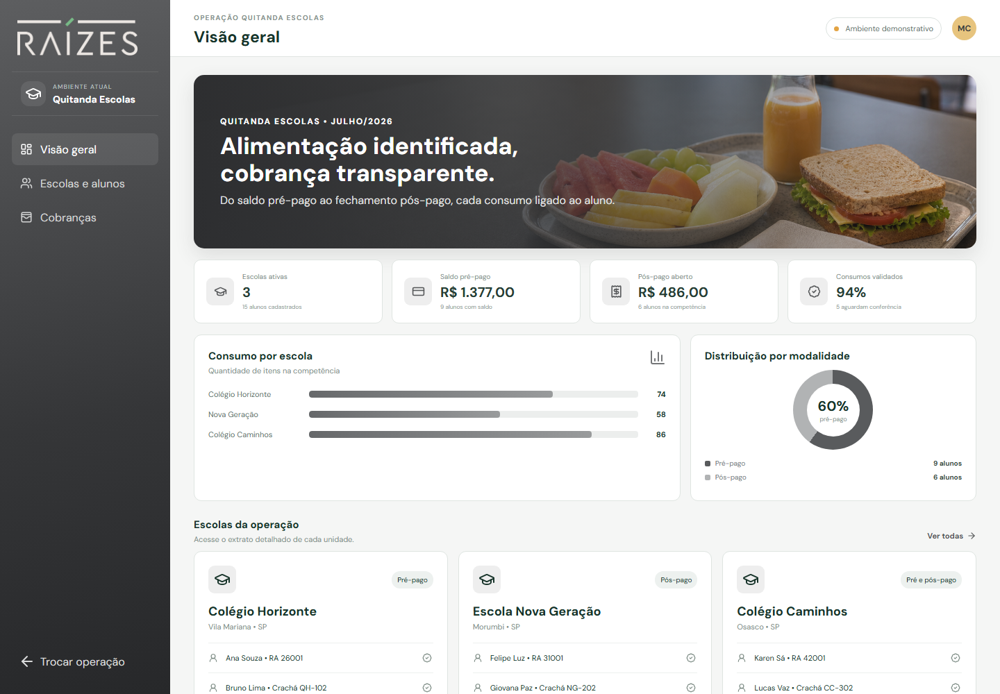
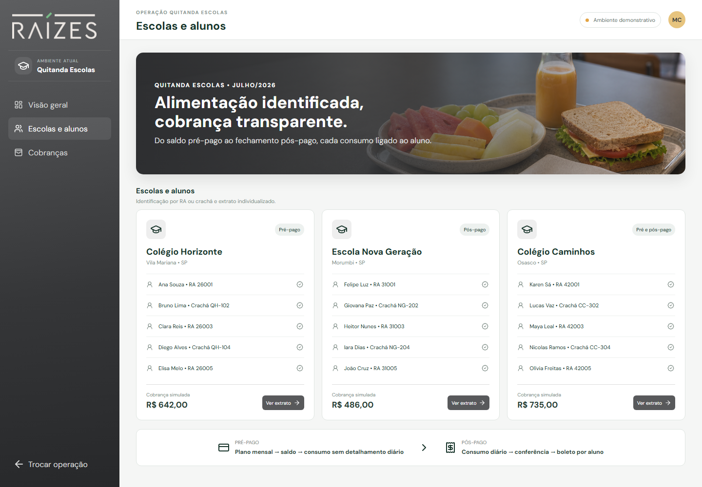
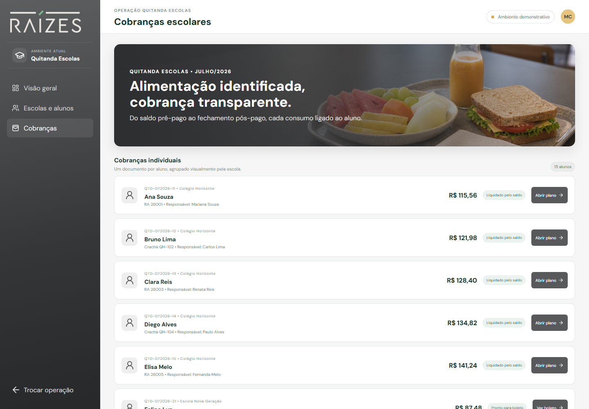

# Faturamento Inteligente — Grupo Raízes

POC navegável para demonstrar um novo fluxo de faturamento das operações **Cucinari** e **Quitanda Escolas**, desde a escolha do ambiente até a memória de cálculo e a cobrança simulada.

> Este projeto usa somente dados fictícios. Não existe autenticação real, persistência, integração bancária, emissão fiscal ou comunicação ativa com o Teknisa.



## Visão do produto

O sistema foi redesenhado para manter a identidade visual do Grupo Raízes e separar completamente os dois modelos de negócio:

- **Cucinari:** faturamento contratual de refeições corporativas, hospitalares e empresariais.
- **Quitanda Escolas:** planos mensais pré-pagos e cobranças pós-pagas individualizadas por aluno.

Após o login, o usuário escolhe qual operação deseja acessar. Clientes, regras, cálculos e cobranças não são misturados entre os ambientes.



## Executar localmente

Requisitos: Node.js 20 ou superior.

```bash
npm install
npm run dev -- --port 7277
```

Acesse `http://localhost:7277`.

No Windows, também é possível executar:

```text
iniciar-ambiente.bat
```

O arquivo inicia o Vite na porta `7277` e abre o navegador automaticamente.

### Credenciais demonstrativas

Os campos já aparecem preenchidos na tela inicial:

```text
E-mail: financeiro@gruporaizes.com.br
Senha: demonstracao
```

Qualquer combinação não vazia funciona nesta POC. Isso não representa uma autenticação de produção.

## Ambiente Cucinari

O ambiente Cucinari apresenta três contratos com regras diferentes:

| Cliente | Regra principal | Volume demonstrativo | Total simulado |
|---|---|---:|---:|
| Indústrias Aurora | 300 funcionários, quatro serviços todos os dias | 37.200 refeições | R$ 492.900,00 |
| Hospital Santa Clara | Franquia de 200 refeições por dia e convidados adicionais | 6.284 refeições | R$ 94.848,00 |
| Grupo Horizonte | 20 almoços, de segunda a sexta | 460 refeições | R$ 8.970,00 |

### Indústrias Aurora

Cada um dos 300 funcionários recebe diariamente:

- um café da manhã;
- um almoço;
- um jantar;
- um lanche noturno.

O número sete representa os dias de uma semana completa. Portanto, cada serviço gera 2.100 refeições semanais e 9.300 refeições em julho de 2026, que possui 31 dias.

| Serviço | Por dia | No mês | Valor unitário fictício | Subtotal |
|---|---:|---:|---:|---:|
| Café da manhã | 300 | 9.300 | R$ 8,50 | R$ 79.050,00 |
| Almoço | 300 | 9.300 | R$ 18,00 | R$ 167.400,00 |
| Jantar | 300 | 9.300 | R$ 17,00 | R$ 158.100,00 |
| Lanche noturno | 300 | 9.300 | R$ 9,50 | R$ 88.350,00 |
| **Total** | **1.200** | **37.200** |  | **R$ 492.900,00** |



### Hospital Santa Clara

O cenário hospitalar separa as refeições por público:

- Diretoria;
- Funcionários;
- Pacientes;
- Convidados.

O contrato-base considera 200 refeições diárias. Convidados aparecem separadamente como adicionais no demonstrativo e no boleto.

### Grupo Horizonte

O contrato considera 20 funcionários, somente almoço, de segunda a sexta-feira. Julho de 2026 possui 23 dias de segunda a sexta, resultando em 460 almoços. Feriados ainda não são tratados na POC.

### Navegação Cucinari

- Visão geral da competência.
- Cenários e contratos.
- Memória de cálculo por cliente.
- Boletos simulados.





## Ambiente Quitanda Escolas

O ambiente escolar possui três colégios fictícios e cinco alunos por unidade:

| Escola | Modalidade | Alunos |
|---|---|---:|
| Colégio Horizonte | Pré-pago | 5 |
| Escola Nova Geração | Pós-pago | 5 |
| Colégio Caminhos | Pré-pago e pós-pago | 5 |

Cada aluno é identificado por **RA ou crachá** e possui cobrança individual associada a um responsável financeiro fictício.



### Pré-pago

No pré-pago, a visão principal é mensal. O sistema apresenta:

- mês de referência;
- aluno e identificação;
- plano contratado;
- valor mensal;
- valor utilizado;
- saldo disponível;
- boleto simulado de recarga.

Os itens consumidos diariamente não são detalhados, pois já fazem parte do plano contratado.

Planos demonstrativos:

- Lanche + almoço;
- Somente lanche;
- Almoço completo.

### Pós-pago

No pós-pago, cada aluno possui:

- relação completa dos consumos por data;
- item consumido;
- quantidade;
- valor individual;
- consolidação mensal;
- boleto individual simulado.





## Documentos e impressão

Extratos, resumos mensais e boletos possuem modo de impressão preparado para A4:

- logo original do Grupo Raízes;
- margens e tipografia próprias para documento;
- tabelas alinhadas;
- remoção do fundo e dos botões da aplicação;
- preservação das cores de status;
- código de barras exclusivamente decorativo.

Todos os documentos exibem avisos de simulação e não possuem valor bancário ou fiscal.

## Links de pré-visualização

Os parâmetros abaixo existem apenas para documentação e apresentação. O fluxo normal continua começando pelo login.

| Tela | URL |
|---|---|
| Seleção de operação | `http://localhost:7277/?preview=selection` |
| Visão geral Cucinari | `http://localhost:7277/?preview=cucinari` |
| Memória de cálculo Cucinari | `http://localhost:7277/?preview=cucinari-calculo` |
| Boletos Cucinari | `http://localhost:7277/?preview=cucinari-boletos` |
| Dashboard Quitanda | `http://localhost:7277/?preview=quitanda` |
| Escolas e alunos | `http://localhost:7277/?preview=quitanda-escolas` |
| Cobranças escolares | `http://localhost:7277/?preview=quitanda-cobrancas` |

## Observações importantes

- Preços, volumes, pessoas, documentos e responsáveis são fictícios.
- A competência disponível é julho de 2026.
- O cenário Aurora considera funcionamento durante os 31 dias do mês.
- O cenário Grupo Horizonte exclui sábados e domingos, mas ainda não trata feriados.
- A política do Hospital para convidados ainda precisa ser validada: sempre adicional ou consumo da franquia.
- No pré-pago escolar, a política de saldo insuficiente ainda não foi definida.
- Os boletos não possuem linha digitável funcional.
- “Teknisa” representa a integração futura esperada; atualmente não ocorre nenhuma chamada externa.
- Dados criados ou alterados durante a navegação não possuem persistência em banco.
- A tela de login é apenas uma barreira visual da demonstração.

## Estado atual

Implementado:

- login demonstrativo;
- seleção e segregação das operações;
- dashboard Cucinari;
- três cenários contratuais;
- memória de cálculo explicável;
- dashboard Quitanda Escolas;
- três escolas e quinze alunos;
- planos pré-pagos e consumo pós-pago;
- cobranças individuais por aluno;
- extratos e boletos simulados;
- impressão profissional em A4;
- responsividade básica.

Ainda pendente para uma versão de produção:

- autenticação e autorização reais;
- API e banco de dados;
- integração homologada com o Teknisa;
- motor de regras parametrizável;
- calendário de feriados;
- auditoria persistente;
- geração real de PDFs;
- testes automatizados;
- revisão de segurança;
- homologação financeira das fórmulas e valores.

## Validação técnica

```bash
npm run typecheck
npm run build
```

O comando `npm test` está configurado, mas ainda não existem arquivos de teste no projeto.

## Documentação funcional

O fluxo detalhado, critérios de aceite, decisões pendentes e backlog estão em:

- [`docs/NOVO_FLUXO_E_BACKLOG.md`](docs/NOVO_FLUXO_E_BACKLOG.md)
