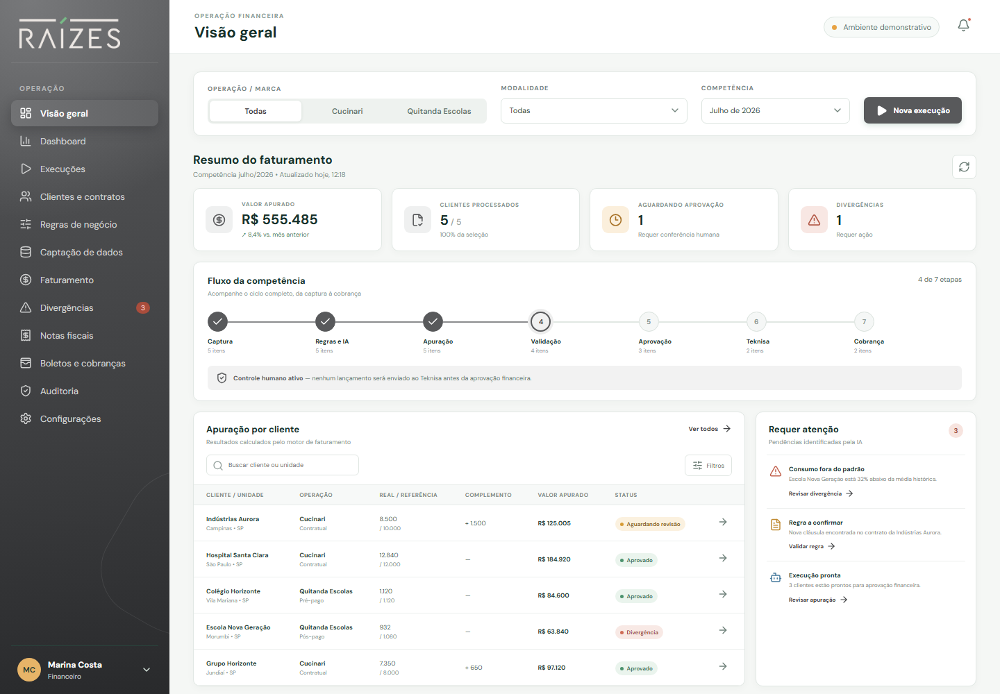
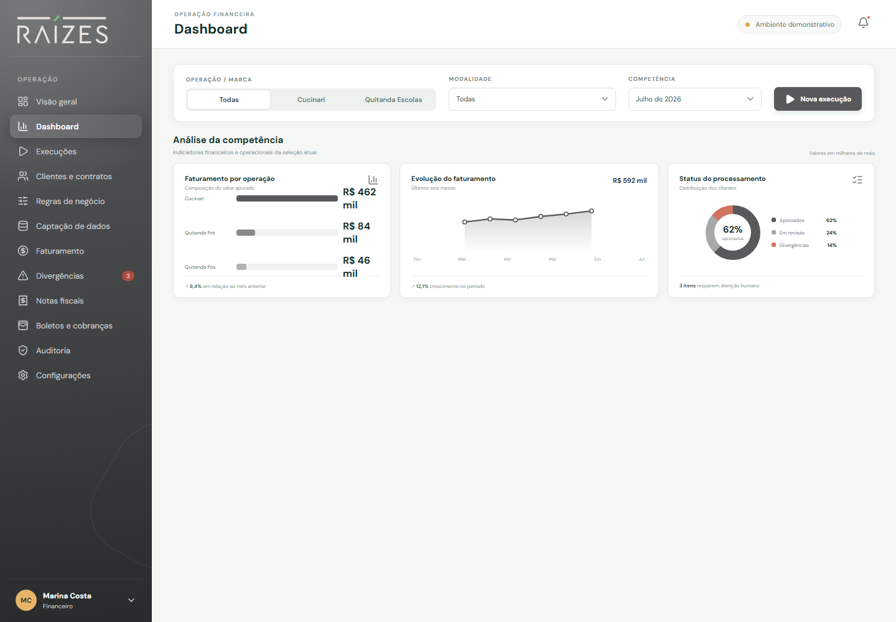
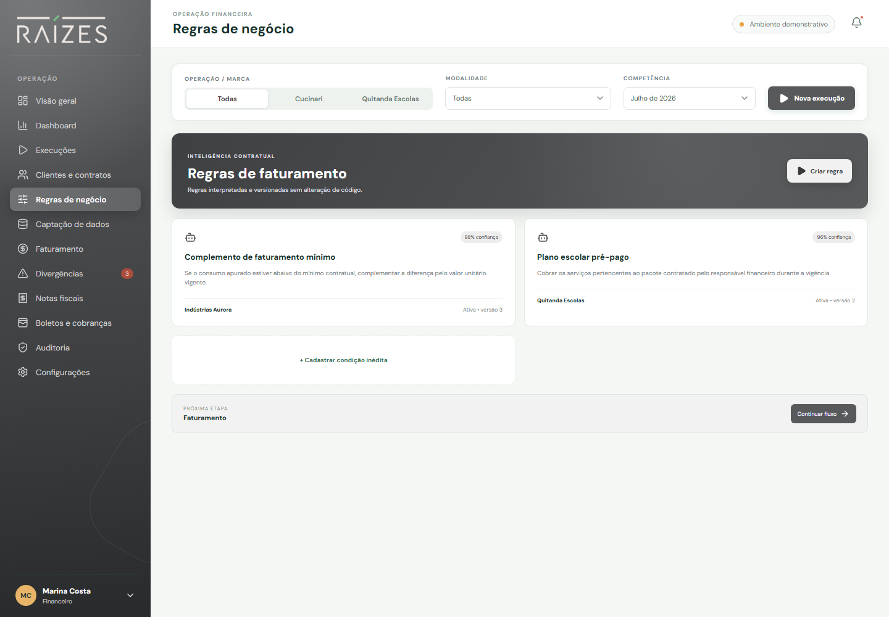
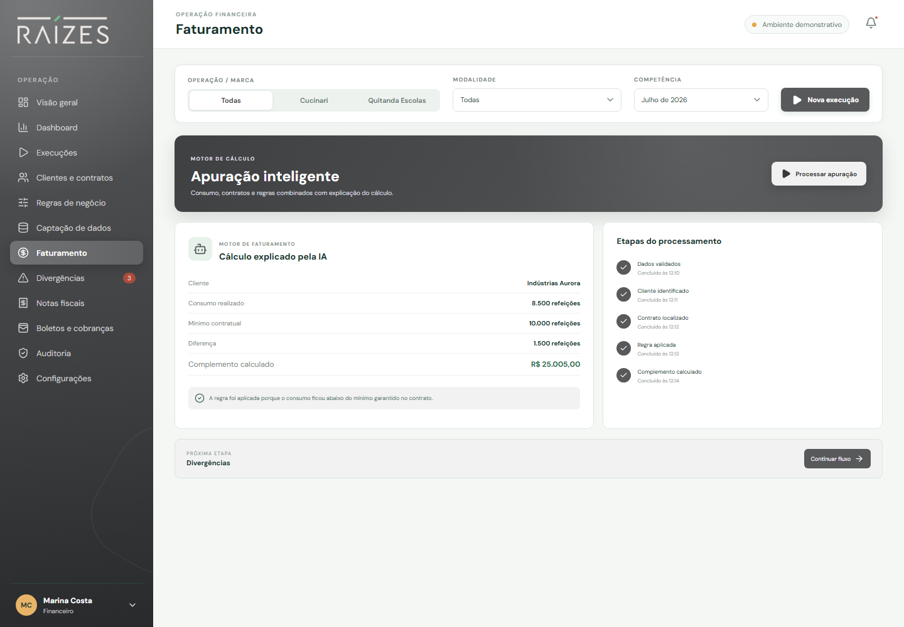
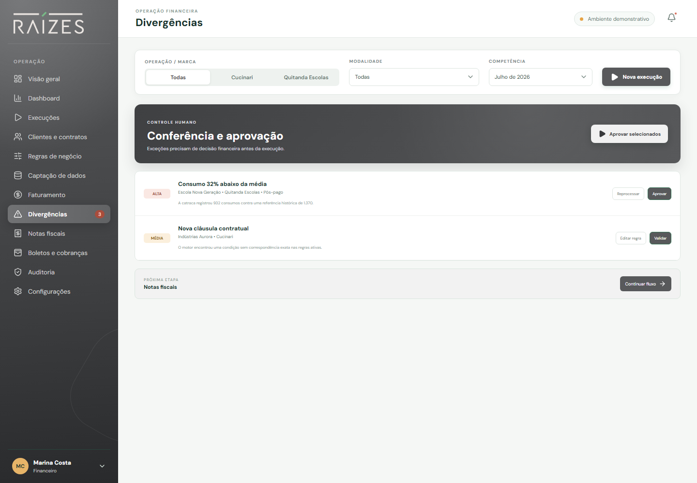

# Grupo Raízes — Faturamento Inteligente

POC navegável para validar a automação do faturamento das operações **Cucinari** e **Quitanda Escolas**, desde a captura dos dados até a preparação de notas fiscais, boletos e cobranças.

> Ambiente demonstrativo: os dados são fictícios e as integrações com Oracle/Teknisa, catracas, emissão fiscal e cobrança estão simuladas.

## O desafio

O processo atual combina dados do ERP, planilhas individuais por cliente, regras contratuais e um RPA legado. A POC demonstra como centralizar essa operação em um fluxo seguro e auditável:

```text
Captura → Regras e IA → Apuração → Validação humana
        → Aprovação → Teknisa → Nota fiscal → Cobrança → Auditoria
```

O sistema contempla:

- **Cucinari:** contratos, consumo real, mínimos contratuais e complementos de faturamento.
- **Quitanda Escolas — Pré-pago:** planos e pacotes contratados pelos responsáveis.
- **Quitanda Escolas — Pós-pago:** consumo efetivamente registrado pelas catracas.

## Visão geral

A tela inicial concentra o estado da competência: valor apurado, clientes processados, aprovações, divergências, pipeline operacional e itens que exigem atenção.



## Dashboard gerencial

O dashboard apresenta três leituras complementares:

- faturamento por operação em barras;
- evolução dos últimos seis meses em linha;
- distribuição entre aprovados, revisões e divergências em rosca.

Os gráficos respondem aos filtros globais de operação e modalidade.



## Regras de negócio

Centraliza as condições hoje distribuídas em planilhas. A proposta permite vincular regras ao cliente ou à operação, controlar versões e cadastrar uma condição contratual inédita sem alterar código.



## Apuração explicável

O motor combina cliente, contrato, consumo, período e regras. Cada resultado apresenta os valores utilizados e uma justificativa compreensível para o time financeiro.



Exemplo demonstrado:

| Informação | Valor |
|---|---:|
| Consumo realizado | 8.500 refeições |
| Mínimo contratual | 10.000 refeições |
| Diferença | 1.500 refeições |
| Complemento calculado | R$ 25.005,00 |

## Divergências e aprovação humana

Situações críticas não seguem automaticamente para o ERP. A central de divergências apresenta severidade, contexto e ações para revisar, editar, reprocessar ou aprovar.



## Telas disponíveis

| Tela | Finalidade |
|---|---|
| Visão geral | Resumo da competência e pipeline operacional |
| Dashboard | Indicadores financeiros e operacionais |
| Execuções | Ciclos de faturamento por competência |
| Clientes e contratos | Base contratual centralizada |
| Regras de negócio | Condições, versões e interpretação das regras |
| Captação de dados | Fontes, volumes e situação das sincronizações |
| Faturamento | Cálculo e explicação da regra aplicada |
| Divergências | Conferência e aprovação humana |
| Notas fiscais | Preparação da execução no Teknisa |
| Boletos e cobranças | Geração e envio das cobranças |
| Auditoria | Rastreabilidade das ações automáticas e humanas |
| Configurações | Proteções e limites do ambiente demonstrativo |

## Segurança da POC

A interface deixa explícito que:

- nenhuma escrita real é realizada no Oracle/Teknisa;
- nenhuma nota fiscal ou boleto real é emitido;
- a aprovação humana é obrigatória antes da etapa de execução;
- todas as ações da demonstração utilizam dados fictícios;
- a integração real deverá começar com acesso somente leitura e uma competência já encerrada.

## Executar localmente

Requisitos: Node.js 20 ou superior.

```bash
npm install
npm run dev
```

A aplicação ficará disponível no endereço informado pelo Vite, normalmente:

```text
http://localhost:5173
```

Para gerar o pacote de produção:

```bash
npm run build
```

## Links diretos para demonstração

Com o servidor local em execução, é possível abrir diretamente algumas telas:

- `http://localhost:5173/#Visão%20geral`
- `http://localhost:5173/#Dashboard`
- `http://localhost:5173/#Regras%20de%20negócio`
- `http://localhost:5173/#Faturamento`
- `http://localhost:5173/#Divergências`

## Escopo recomendado para a próxima fase

1. Selecionar uma competência já encerrada.
2. Escolher dois ou três clientes Cucinari com regras diferentes.
3. Selecionar uma escola pré-paga e uma pós-paga.
4. Conectar as fontes em modo somente leitura.
5. Comparar os cálculos da solução com as planilhas homologadas.
6. Validar divergências e aprovações com o time financeiro.
7. Somente depois da homologação, evoluir para a execução no Teknisa.

## Documentação detalhada

O material completo para apresentação ao cliente, incluindo validação tela a tela, lacunas e critérios de sucesso, está em:

[APRESENTACAO_POC_GRUPO_RAIZES.md](APRESENTACAO_POC_GRUPO_RAIZES.md)

---

Desenvolvido como prova de conceito para o **Grupo Raízes**, com foco em redução do trabalho manual, aplicação segura de regras contratuais, controle humano e rastreabilidade.
